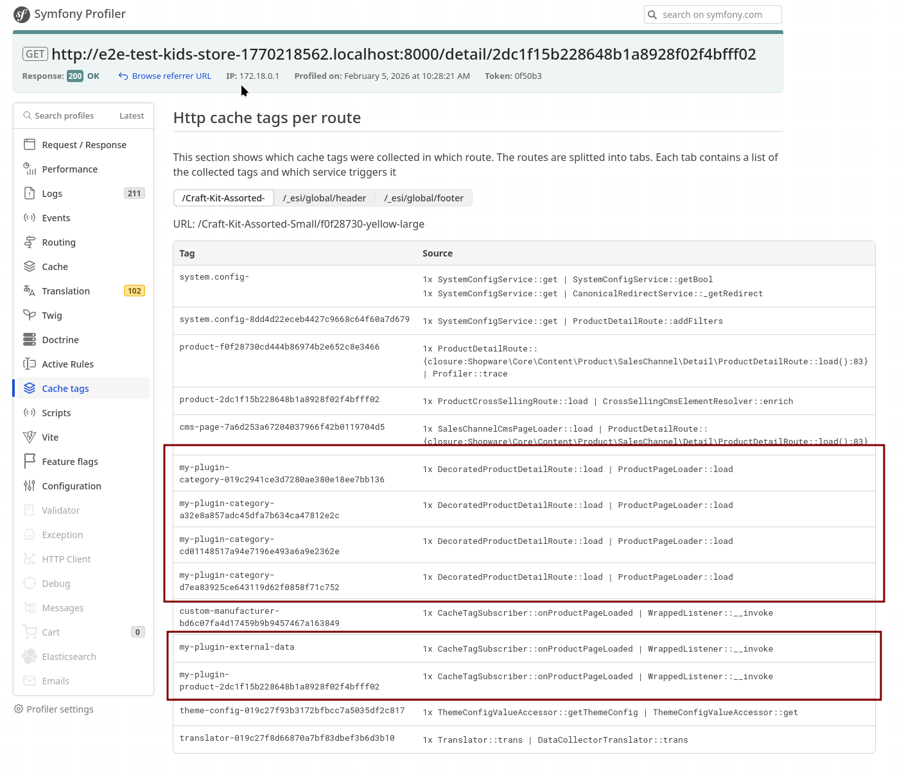

# SwagCacheTagExample

Example plugin demonstrating the **new cache tag system** introduced in Shopware 6.7.

> **Important:** Always test cache tags in both development AND production mode! The Symfony Profiler is only available in development mode. See [Production Mode vs. Development Mode](#production-mode-vs-development-mode) for details.

## Quick Start

### Option 1: Clone into existing Shopware project

```bash
# Navigate to your Shopware installation
cd /path/to/shopware

# Clone the plugin into custom/plugins
git clone https://github.com/shopware/SwagCacheTagExample.git custom/plugins/SwagCacheTagExample

# Register the plugin with Composer (for autoloading)
composer config repositories.swag-cache-tag-example '{"type": "path", "url": "custom/plugins/SwagCacheTagExample", "options": {"symlink": true}}'
composer require "swag/cache-tag-example:*"

# Install and activate the plugin
bin/console plugin:refresh
bin/console plugin:install --activate SwagCacheTagExample
bin/console cache:clear
```

### Option 2: Copy plugin files manually

```bash
# Copy the plugin folder to your Shopware installation
cp -r SwagCacheTagExample /path/to/shopware/custom/plugins/

# Then follow the Composer and activation steps from Option 1
```

### Option 3: Use as a template

1. Fork this repository
2. Rename the plugin namespace and files to match your plugin name
3. Modify the cache tag logic for your use case

### Verify Installation

After installation, visit a product page and check:

```bash
# Check if cache tags are added (development mode)
# Open Symfony Profiler > Cache tags section

# Or check response headers (any mode)
curl -I "http://localhost:8000/detail/your-product-id" | grep "x-shopware-cache-id"
```

You should see tags like `my-plugin-external-data`, `my-plugin-product-*`, etc.

## Background

With Shopware 6.7, the separate Store-API route caching layer was removed. This means:

- The `Cached*Route` decorator classes were removed
- All `*CacheTagsEvent` events are **deprecated** and **no longer dispatched**
- These events will be completely removed in 6.8

The caching now happens exclusively at the **HTTP layer**, which simplifies the architecture and improves cache efficiency.

## Migration Guide

### Old Approach (6.6 and earlier) - DEPRECATED

```php
use Shopware\Core\Content\Product\Events\ProductDetailRouteCacheTagsEvent;

class OldCacheTagSubscriber implements EventSubscriberInterface
{
    public static function getSubscribedEvents(): array
    {
        return [
            ProductDetailRouteCacheTagsEvent::class => 'onProductDetailCacheTags',
        ];
    }

    public function onProductDetailCacheTags(ProductDetailRouteCacheTagsEvent $event): void
    {
        $event->addTags(['my-custom-tag']);
    }
}
```

### New Approach (6.7+) - RECOMMENDED

```php
use Shopware\Core\Framework\Adapter\Cache\CacheTagCollector;
use Shopware\Storefront\Page\Product\ProductPageLoadedEvent;

class NewCacheTagSubscriber implements EventSubscriberInterface
{
    public function __construct(
        private readonly CacheTagCollector $cacheTagCollector,
    ) {
    }

    public static function getSubscribedEvents(): array
    {
        return [
            ProductPageLoadedEvent::class => 'onProductPageLoaded',
        ];
    }

    public function onProductPageLoaded(ProductPageLoadedEvent $event): void
    {
        $this->cacheTagCollector->addTag('my-custom-tag');
    }
}
```

## Plugin Structure

```
SwagCacheTagExample/
├── composer.json
├── phpunit.xml
├── README.md
├── docs/
│   └── images/
│       └── symfony-profiler-cache-tags.png  # Screenshot showing working cache tags
├── src/
│   ├── SwagCacheTagExample.php              # Plugin base class
│   ├── Resources/
│   │   └── config/
│   │       └── services.xml                 # Service definitions
│   ├── Subscriber/
│   │   ├── CacheTagSubscriber.php           # Add tags via page events
│   │   ├── CacheRuleAreaSubscriber.php      # Add custom rule areas
│   │   └── DebugCacheTagSubscriber.php      # Debug logging for verification
│   ├── Route/
│   │   └── DecoratedProductDetailRoute.php  # Add tags via route decoration
│   └── Service/
│       └── CustomCacheInvalidator.php       # Invalidate cache by tags
└── tests/
    ├── TestBootstrap.php                    # PHPUnit bootstrap for Shopware
    └── Unit/
        ├── Subscriber/
        │   └── CacheTagSubscriberTest.php
        └── Service/
            └── CustomCacheInvalidatorTest.php
```

## Examples Included

### 1. CacheTagSubscriber

Subscribe to page loaded events and add cache tags:

```php
$this->cacheTagCollector->addTag('my-custom-tag', 'another-tag');
```

### 2. CacheRuleAreaSubscriber

Add custom rule areas for cache key calculation:

```php
$extension->ruleAreas[] = 'myPluginCustomArea';
```

### 3. DecoratedProductDetailRoute

Decorate routes to add cache tags based on route-specific logic.

### 4. CustomCacheInvalidator

Invalidate cache entries by your custom tags:

```php
$this->cacheInvalidator->invalidate(['my-custom-tag']);
```

### 5. DebugCacheTagSubscriber

Logs all cache tags for debugging purposes. Check your logs to verify tags are being added.

## Key Changes in 6.7

1. **Unified HTTP Cache**: Caching now happens at the HTTP layer only
2. **CacheTagCollector**: Use `addTag()` method to add cache tags
3. **Rule Area Optimization**: Only relevant rules affect cache keys
4. **Logged-in Users Cached**: Cache is active by default (opt-out instead of opt-in)

## Installation

```bash
# Refresh plugin list
bin/console plugin:refresh

# Install and activate
bin/console plugin:install --activate SwagCacheTagExample

# Clear cache
bin/console cache:clear
```

## Verifying Cache Tags in the Storefront

After installing the plugin, use these methods to verify that cache tags are being added correctly.

### Method 1: Browser DevTools (Easiest)

1. Open **Chrome/Firefox DevTools** (F12)
2. Go to the **Network** tab
3. Visit a **product detail page** in your storefront
4. Click on the **first request** (the HTML document)
5. Check the **Response Headers** for:

```
x-shopware-cache-id: product-abc123,my-plugin-external-data,my-plugin-product-abc123,custom-manufacturer-xyz789,...
```

**Success indicator**: You should see tags starting with `my-plugin-` or `custom-manufacturer-` in the header value.

### Method 2: Check Log Files

The plugin includes a debug subscriber that logs all cache tags. After visiting a page:

```bash
# Watch the log file in real-time
tail -f var/log/dev.log | grep "SwagCacheTagExample"

# Or search in the log file
grep "SwagCacheTagExample" var/log/dev.log
```

Expected output:
```
[2025-02-05T12:34:56] cache.INFO: [SwagCacheTagExample] Cache tags added {"tags":["my-plugin-external-data","my-plugin-product-abc123"],"all_tags":["product-abc123","navigation",...]}
```

### Method 3: Symfony Profiler (Debug Mode)

1. Set `APP_DEBUG=1` in your `.env` file
2. Visit a product page in the storefront
3. Click on the **Symfony Profiler toolbar** at the bottom of the page
4. Navigate to the **"Cache tags"** section
5. You'll see all collected cache tags listed



**Understanding the Profiler Output:**

In the screenshot above, you can see the cache tags added by our plugin:

| Tag | Count | Source | Explanation |
|-----|-------|--------|-------------|
| `my-plugin-category-*` | 4x | `DecoratedProductDetailRoute::load` | The product belongs to **4 categories**, so the loop adds one tag per category |
| `custom-manufacturer-*` | 1x | `CacheTagSubscriber::onProductPageLoaded` | One tag for the product's manufacturer |
| `my-plugin-external-data` | 1x | `CacheTagSubscriber::onProductPageLoaded` | Global tag for external data invalidation |
| `my-plugin-product-*` | 1x | `CacheTagSubscriber::onProductPageLoaded` | One tag for the specific product |

**Why do some tags appear multiple times?**

The `my-plugin-category-*` tag appears 4 times because of this code in `DecoratedProductDetailRoute`:

```php
// This loops through ALL categories the product belongs to
foreach ($product->getCategoryIds() as $categoryId) {
    $this->cacheTagCollector->addTag('my-plugin-category-' . $categoryId);
}
```

This is intentional! When any of these categories is updated, the cached product page will be invalidated. This ensures cache consistency when:
- A category name changes
- A category is deleted
- Category-specific rules change

### Method 4: curl Command

```bash
# Check response headers directly
curl -I "https://your-shop.local/detail/your-product-id" 2>/dev/null | grep -i "x-shopware-cache"
```

Expected output:
```
x-shopware-cache-id: navigation,product-abc123,my-plugin-external-data,my-plugin-product-abc123,...
```

### Method 5: Enable HTTP Cache and Test Invalidation

1. **Enable HTTP Cache:**
   ```bash
   bin/console system:config:set storefront.httpCache.enabled true
   bin/console cache:clear
   ```

2. **Visit a product page twice:**
   - First visit: Response header shows `x-symfony-cache: miss` (cache miss)
   - Second visit: Response header shows `x-symfony-cache: fresh` (cache hit)

3. **Invalidate by your custom tag:**
   ```bash
   bin/console cache:invalidate my-plugin-external-data
   ```

4. **Visit the page again:**
   - Should show `x-symfony-cache: miss` again (cache was invalidated)

## Testing

### Run Unit Tests

```bash
# Using Docker (recommended)
docker exec shopware-docker-web-1 ./vendor/bin/phpunit -c custom/plugins/SwagCacheTagExample/phpunit.xml --testdox

# Or from within the container
docker exec -it shopware-docker-web-1 bash
./vendor/bin/phpunit -c custom/plugins/SwagCacheTagExample/phpunit.xml --testdox

# Using devenv shell (if PHP version matches)
devenv shell ./vendor/bin/phpunit -c custom/plugins/SwagCacheTagExample/phpunit.xml --testdox
```

**Note:** Make sure the plugin is installed via Composer before running tests:

```bash
docker exec shopware-docker-web-1 composer config repositories.swag-cache-tag-example '{"type": "path", "url": "custom/plugins/SwagCacheTagExample", "options": {"symlink": true}}'
docker exec shopware-docker-web-1 composer require "swag/cache-tag-example:*"
```

### Integration Testing Example

For integration tests, you can verify cache tags are properly collected:

```php
public function testCacheTagsAreCollected(): void
{
    $this->browser->request('GET', '/detail/your-product-id');

    $response = $this->browser->getResponse();
    $cacheId = $response->headers->get('X-Shopware-Cache-Id');

    static::assertStringContainsString('my-plugin-external-data', $cacheId);
    static::assertStringContainsString('my-plugin-product-', $cacheId);
}
```

### Acceptance Testing with Playwright

```typescript
test('cache tags are added to product page', async ({ page }) => {
    const response = await page.goto('/detail/your-product-id');
    const cacheId = response?.headers()['x-shopware-cache-id'] ?? '';

    expect(cacheId).toContain('my-plugin-external-data');
});
```

## Production Mode vs. Development Mode

Cache behavior differs significantly between development and production modes. **Always test your cache tags in production mode before deploying!**

### Key Differences

| Aspect | Development Mode (`APP_DEBUG=1`) | Production Mode (`APP_DEBUG=0`) |
|--------|----------------------------------|--------------------------------|
| **Symfony Profiler** | Available - shows all cache tags | Not available |
| **HTTP Cache** | May be disabled or limited | Fully active |
| **Cache-Control headers** | May include `no-cache` | Proper caching directives |
| **Response time** | Slower (debug overhead) | Faster (optimized) |
| **Visibility** | Easy to debug via profiler | Must check response headers |

### Testing in Production Mode

Since the Symfony Profiler is not available in production, use these methods to verify cache tags:

**1. Check Response Headers with curl:**

```bash
# Check cache tags in production
curl -I "https://your-shop.com/detail/product-id" 2>/dev/null | grep -i "x-shopware-cache"

# Expected output:
# x-shopware-cache-id: product-abc123,my-plugin-external-data,my-plugin-category-xyz,...
```

**2. Verify Cache Hit/Miss:**

```bash
# First request (should be MISS)
curl -I "https://your-shop.com/detail/product-id" | grep -i "x-symfony-cache"
# x-symfony-cache: GET /detail/product-id: miss, store

# Second request (should be HIT)
curl -I "https://your-shop.com/detail/product-id" | grep -i "x-symfony-cache"
# x-symfony-cache: GET /detail/product-id: fresh
```

**3. Test Cache Invalidation:**

```bash
# 1. Visit page (creates cache entry)
curl -I "https://your-shop.com/detail/product-id"

# 2. Invalidate by your custom tag
bin/console cache:invalidate my-plugin-external-data

# 3. Visit again (should be MISS - cache was invalidated)
curl -I "https://your-shop.com/detail/product-id" | grep -i "x-symfony-cache"
```

**4. Check Varnish/Reverse Proxy (if used):**

If you use Varnish or another reverse proxy, verify that:
- Tags are passed via the `xkey` header (Varnish with XKey module)
- Invalidation requests reach the proxy
- The proxy correctly purges cached entries

```bash
# Check if xkey header is present (Varnish setup)
curl -I "https://your-shop.com/detail/product-id" | grep -i "xkey"
```

### Production Checklist

Before deploying your cache tag implementation:

- [ ] **Test with `APP_DEBUG=0`** - Profiler won't be available
- [ ] **Verify tags in response headers** - Check `x-shopware-cache-id`
- [ ] **Test cache hit/miss cycle** - Ensure caching actually works
- [ ] **Test invalidation** - Verify `cache:invalidate` removes cached entries
- [ ] **Test with reverse proxy** - If using Varnish/Fastly, verify tag propagation
- [ ] **Load test** - Ensure cache improves performance under load
- [ ] **Monitor cache hit rate** - Use metrics to verify effectiveness

### Common Production Issues

| Issue | Symptom | Solution |
|-------|---------|----------|
| Tags not in headers | `x-shopware-cache-id` missing | Check if HTTP cache is enabled |
| Cache always MISS | Every request rebuilds page | Check `Cache-Control` headers, verify no `no-store` directive |
| Invalidation not working | Old content after data change | Verify tag names match exactly, check invalidation logs |
| Varnish not caching | Low hit rate | Check XKey module config, verify tag header format |

## Troubleshooting

### Cache tags not appearing in headers?

1. **Check if HTTP Cache is enabled:**
   ```bash
   bin/console system:config:get storefront.httpCache.enabled
   ```

2. **Ensure you're not logged in** (by default, logged-in users may bypass cache in older versions)

3. **Clear all caches:**
   ```bash
   bin/console cache:clear
   ```

4. **Check if the plugin is active:**
   ```bash
   bin/console plugin:list | grep SwagCacheTagExample
   ```

### Debug subscriber not logging?

1. Check that `APP_DEBUG=1` is set in `.env`
2. Verify the log channel is configured in `config/packages/monolog.yaml`
3. Check file permissions on `var/log/`

## Documentation

- [Caching Documentation](https://developer.shopware.com/docs/guides/plugins/plugins/framework/caching/)
- [The New Caching System (Blog)](https://www.shopware.com/en/news/new-caching-system/) - Comprehensive overview
- [Upgrade Guide 6.7](https://github.com/shopware/shopware/blob/trunk/UPGRADE-6.7.md) - Section "Removal of Store-API route caching"
- [Upgrade Guide 6.8](https://github.com/shopware/shopware/blob/trunk/UPGRADE-6.8.md) - Documents removal of deprecated events

## License

MIT
